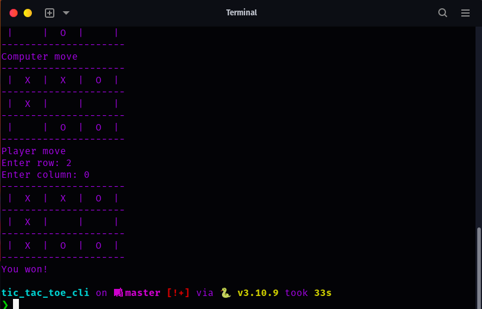

# Tic-Tac-Toe Game

This is a simple implementation of the classic game Tic-Tac-Toe in Python. The game allows you to play against a computer opponent.

```bash
git clone https://github.com/j-breedlove/tic_tac_toe_cli.git
cd tic_tac_toe_cli
```

## How to Play

1. Run the script in a Python environment.
2. Choose your side: 'X' or 'O'.
3. The game board will be displayed.
4. Take turns with the computer to make moves by entering the row and column numbers.
5. The first player to align three of their marks in a row, column, or diagonal wins the game.
6. If no player achieves a winning combination and there are no more moves left, the game ends in a draw.

## Code Structure

The code consists of a single class `TicTacToe` that represents the game. Here's a brief explanation of the methods in the class:

- `__init__()`: Initializes the game by setting up the game board and player inputs.
- `choose_side()`: Prompts the user to choose their side ('X' or 'O').
- `create_board()`: Displays the current state of the game board.
- `player_move()`: Handles the player's move by accepting row and column inputs and updating the game board accordingly.
- `computer_move()`: Simulates the computer's move by selecting a random available position on the board.
- `play_game()`: Starts the game by calling other methods in a loop until the game ends.
- `check_winner()`: Checks for a winning combination or a draw on the game board.

## Example Usage

```python
import random

# Create an instance of the TicTacToe game
new_game = TicTacToe()

# Start playing the game
new_game.play_game()
```

Enjoy playing Tic-Tac-Toe! Good luck!
